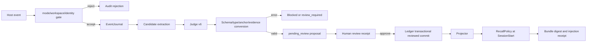

# Normal Workspace Guarded Rollout Design

**日期：** 2026-09-08
**状态：** 方案 B 修订稿，未授权生产启用
**修订依据：** 2026-09-08 安全审查不通过；用户已批准 Ledger 持久化控制面方向
**前置证据：** v6 Judge 基线、S3-3/S3-4 通过、S3-5/G6 隔离纵向 `103/103` 通过

## 1. 目标与边界

本设计定义 SagaContext 从隔离验收进入正常 workspace 灰度运行的方式。目标是让
真实 workspace 的事件能够进入受控候选、审核、写入、投影和 SessionStart 召回链路，
同时保留明确的关闭、审计和回滚路径。

本设计不授权立即启用。它不导入历史私人 transcript，不改变 Ledger 的唯一权威边界，
不允许模型输出绕过 proposal/review 直接写入，不把一次 G6 结果当作任意会话质量证明。
正常 workspace 的具体启用仍需要单独批准 workspace、事件类型、写入权限和召回/注入权限。

## 2. 运行模式

运行模式是显式配置，默认值为 `off`：

| 模式 | 隔离事件/审计 | Judge/候选 | 正式 memory 写入 | Projection / SessionStart 注入 |
|---|---|---|---|---|
| `off` | 关闭 | 关闭 | 关闭 | 关闭 |
| `shadow` | 允许，绑定 `rollout_id` | 允许，绑定 `rollout_id` | 关闭 | 关闭 |
| `guarded` | 允许 | 允许 | 仅 `pending_review` 后审核提交 | 仅审核通过的当前记忆 |
| `active` | 首轮不可启用 | 首轮不可启用 | 首轮不可启用 | 首轮不可启用 |

首次正常 workspace 灰度只允许 `shadow` 和 `guarded`。`active` 在首轮实现中是不可达
状态：配置解析、控制 API 和状态转换都必须拒绝它，而不是依赖操作约定。

环境配置只提供 fail-closed 上限：缺失、非法或显式 `SAGACONTEXT_MODE=off` 都视为
`off`。运行中的权威状态保存在 Ledger，不能通过修改进程内 `Config` 绕过。每次非
`off` 启用必须创建新的 `rollout_id`，并在一个事务内绑定：唯一 owner、规范化后的固定
workspace identity、配置中的批准主体、不可重放 `approval_receipt`、`started_at`、明确
`deadline`、session/candidate 上限、后端 generation，以及冻结的 rollback plan 正文和
`rollback_plan_digest`。`deadline` 不得晚于 `started_at +
24h`。降级到 `off` 和 STOP 可以无条件 fail-safe；启用或扩大权限必须认证。

控制 API 不信任请求体中的 `operator`。批准主体来自 daemon 配置，调用方必须提供与该
主体绑定的认证凭据和 approval receipt；数据库只保存凭据摘要，不保存明文。相同 receipt
和相同请求返回原结果，相同 receipt 和不同请求返回冲突。workspace、owner、deadline、
quota、generation 或 rollback plan 的任何变化都必须重新授权并新建 rollout，不能原地
扩大现有 rollout。

### 2.1 控制 API 认证协议

非 `off` 启用请求固定使用以下认证载体；认证信息不得出现在 query、JSON body、receipt
payload 或普通日志中：

- `Authorization: Bearer <operator-token>`：token 从权限受限的本地 secret file 或进程
  环境加载，daemon 配置只关联 token digest、approver subject 和 `key_id`。
- `X-SagaContext-Approver`：必须与该 token 配置的批准主体完全一致。
- `X-SagaContext-Key-Id`：选择 current key；previous key 只允许消费轮换前由服务端登记的
  精确 grant，不能自行签发新请求。
- `X-SagaContext-Approval-Receipt`：调用方生成的不可重放标识。
- `X-SagaContext-Issued-At` 和 `X-SagaContext-Expires-At`：UTC 时间；有效期最长 5 分钟，
  允许最多 60 秒时钟偏差，验证时必须尚未过期。

认证使用 constant-time token digest 比较。request digest 使用规范化 JSON 计算 SHA-256：
键排序、无无意义空白、UTF-8、UTC 时间固定为含六位小数的 RFC 3339 `Z` 格式、quota
使用整数。摘要对象必须包含 `digest_schema_version=rollout-action-v1`；缺失的必填字段和
未知字段均拒绝，不得先丢弃字段再计算摘要。其余公共字段为 `action`、
`approver`、`key_id`、`approval_receipt`、owner、规范化 workspace identity、reason 和
issued/expires 时间；无鉴权 stop/freeze/off 的认证字段固定为 JSON null，不从调用方
声明推断主体。
各 action 还必须绑定以下字段，路径参数与请求字段必须一致：

| action | 摘要额外绑定字段 |
|---|---|
| activation | mode、deadline、session/candidate quota、generation、`rollback_plan_digest` |
| review | `rollout_id`、batch、decision、reviewer |
| stop / freeze / off | 目标 `rollout_id` |
| rollback | 目标 `rollout_id`、`rollback_plan_digest`、执行阶段 |
| grant-registration | 目标 action、目标 receipt、目标完整 request digest、grant 到期时间 |

activation 的 `rollout_id` 由服务端创建并保存在稳定结果中；对已有 rollout 的操作，其
owner/workspace 必须与目标记录一致。grant-registration 使用独立的操作 receipt，不能
占用目标 action 的 receipt。服务端按第 8 节规范化完整 rollback plan 并重新计算 digest；
请求中的 digest 必须匹配，服务端固定模板也必须把模板版本及其完整内容纳入该 digest。
activation grant 因而绑定确切的计划，不能只绑定模板名称。rollback 必须同时匹配请求
摘要中的目标和该目标已冻结的 plan digest；每个阶段使用独立 receipt，相同阶段重试保持
原 receipt。服务端不得接受调用方追加清理目标或替换已冻结计划。

数据库通过全局 `rollout_action_receipts` 对 `(owner_id, receipt)` 建唯一约束，防止 receipt 跨
启用、review、stop 和 rollback 接口重放：首次成功请求原子保存 action、request digest
和结果；重复且 action/digest 均相同返回原结果，否则返回 `receipt_conflict`。过期 receipt
即使此前从未使用也拒绝。

需要跨轮换完成的请求，必须在 current key 仍有效时先调用 grant-registration 操作。服务端
认证该操作后，要求 grant 的 `key_id` 等于服务端当时的 current key，再把 receipt、完整
request digest、key id、服务端 `registered_at`、`expires_at` 和 `unused` 状态原子写入
`rollout_approval_grants`；有效期仍不得超过 5 分钟。服务端在轮换时持久化 `rotated_at`。
轮换发生后，previous key 只接受 `registered_at < rotated_at`、尚未过期且 receipt/request digest 完全匹配
的未消费 grant，并在目标控制事务中原子标记 consumed。调用方提供的 issued time 不能替代
服务端登记时间。未登记 receipt、登记后修改字段、重复消费不同请求、轮换后登记或过期 grant
全部拒绝；已成功操作的精确幂等重试只从 action receipt 返回原结果。

降级到 `off`、STOP 和 freeze 不要求启用凭据，以保证 fail-safe；无鉴权调用只能递增
`control_epoch`、阻止新工作和冻结关联资源，不能处理 proposal、修改正式 memory 或删除
projection。rollback runner 的每个数据变更阶段必须使用 current key 认证，并绑定启用时
已批准且不可修改的 `rollback_plan_digest`；previous key 和无鉴权调用均不得执行数据
回滚。已授权 Projector 操作的在途补偿按第 8 节独立执行，其授权来自原操作及冻结计划，
不来自 stop/freeze 请求，也不能借补偿执行整批回滚。

### 2.2 Ledger 控制面

Schema migration 新增以下持久化关系，禁止在 `Ledger.__init__` 中临时建表：

- `rollout_runs`：`rollout_id`、owner/workspace、mode/status、批准主体、approval receipt
  digest、started/deadline/stopped 时间、停止原因、quota、generation、单调 `control_epoch`，
  以及冻结的完整 rollback plan、plan schema version 和 `rollback_plan_digest`。
- `rollout_action_receipts`：所有控制面写操作共享的不可重放 receipt、action、request
  digest、稳定结果和时间；activation/review/stop/rollback 表通过 receipt 外键关联。
- `rollout_approval_grants`：轮换前由服务端登记的 receipt/request digest、key、登记/过期/
  消费时间；previous key 只能原子消费这里的精确未过期记录。
- `rollout_sessions`：每个 rollout 的 session reservation；以 host session identity 唯一。
- `rollout_candidate_reservations`：每个 rollout 的 candidate slot；与 event/candidate 关联。
- `rollout_events` 和 `rollout_candidates`：把 EventJournal/candidate 行显式归属到 rollout，
  用于隔离查询、配额核对和定向回收。
- `rollout_review_receipts`：receipt、请求 digest、batch、decision、reviewer 和稳定结果。
- `rollout_commits`：本 rollout 实际创建或修改的 memory/revision、projection operation。
- projection operation/claim 持久化关联：原 review/commit receipt、`rollout_id`、operation ID、
  claim ID、claim epoch、generation、精确 locator 和补偿 receipt；外部调用前必须落盘。
- `rollout_rollback_receipts`：回滚阶段、目标资源、结果和验证摘要。

同一 owner 同一时刻最多一个未终结 rollout；状态为 `running`、`draining`、`stopping`、
`stopped` 或 `cleanup_required`。所有非 `off` gate 都必须读取同一条有效记录，并同时校验
mode、workspace、deadline、control epoch 和 generation。`draining` 只允许已 reservation
的 session 及其关联 candidate/batch 完成事件、Judge、review/commit 和 projection，不允许
新 session、无归属工作或扩大 scope。
STOP 文件一旦被观察到，观察者须在事务中递增 `control_epoch` 并转入停止状态；工作单元
捕获的旧 epoch 此后不能提交或确认正常处理结果；第 8 节允许的补偿只记独立的终态
receipt，不得把旧 epoch 的 projection 确认为成功。

## 3. 启用范围

首轮灰度固定为：

- workspace：`/Users/lqy0584/Downloads/SagaContext`
- 数据：启用后的新事件；不扫描或导入历史私人 transcript
- 事件：`SessionStart`、`UserPromptSubmit`、`Stop`、`SessionEnd`
- Judge：冻结 `openai-judge-prompt-v6`、`delta-v3`、`delta-to-proposal-v2`
- 后端：已准入 OpenViking generation；Ledger 仍是正文和状态的唯一来源
- 宿主：已验证的 Codex event receipt；不扩大到未经 G3 验证的事件

事件处理前必须验证 workspace identity、owner、session identity、host version 和
generation。越界事件只产生安全拒绝审计，不进入候选或注入。

## 4. 事件与数据流



`UserPromptSubmit`、`Stop` 和 `SessionEnd` 负责事件记录、候选维护和对账触发，不直接
向宿主注入正文。只有 `SessionStart` 可以产生 context injection，而且每次都要重新
从 Ledger 和后端 hit 组装 bundle。

这里的 Ledger 分为两个数据域：EventJournal、rollout reservation 和 audit receipt 属于
隔离控制面/审计数据；`memories/revisions/evidence` 和 projection outbox 属于正式 memory
数据。`shadow` 允许写入前一类，并允许生成绑定 `rollout_id` 的 candidate、batch 和
proposal 供观察，但禁止调用 proposal commit、创建或修改正式 memory/evidence、创建
projection outbox、执行 backend projection 或向宿主注入正文。

所有 shadow event、candidate、batch 和 proposal 都必须能通过关联表按 `rollout_id` 完整
枚举。rollout 结束后，通过 current key 和冻结计划校验的 rollback runner 导出脱敏
digest/计数 artifact，再按第 8 节的隔离数据来源定向删除或墓碑化这些 shadow 行及
reservation。长期保留授权、归属和幂等校验所需的控制记录，以及 mode、拒绝、清理和
汇总 audit receipt，不保留已回收临时行的正文。任何已被其他 rollout 或正式 memory
引用的行都不得直接删除，而应进入 `cleanup_required` 并阻断“已回收”结论。不得按时间
窗口或 owner 全表清理。

## 5. 候选、Judge 与写入

候选必须带有 session、workspace、owner、task（若有）、event IDs、memory type hint、
scope hint 和 topic key。候选选择只使用启用后的事件，候选来源和 input digest 写入 batch。

Judge 输出先经过以下不可绕过的检查：

1. Wire schema 和安全诊断检查。
2. `type == memory_type_hint`；relation 与 memory type 独立，`conflict` 不是 memory type。
3. anchor、revision、scope、candidate coverage 和 evidence IDs 属于冻结上下文。
4. refine 保留 anchor 的完整 body；固定命令、路径和枚举不接受解释性改写。
5. converter 失败为 non-retryable blocked，不转成 `no_change`。

合法 proposal 的默认状态是 `pending_review`。审核前不进入正式 memory，不进入可注入
bundle。daemon 的 `/memories/commit` direct commit 入口在所有模式下关闭，不允许通过先
切回 `off` 绕过审核。底层 `Ledger.commit` 仅保留为受控内部维护原语，不暴露为本地 HTTP
写接口。首轮灰度的唯一正式写入入口是带审核 receipt 的 batch commit。底层
`Ledger.commit_batch` 不能仅凭 lease 提交 guarded batch，还必须验证同一事务中的 rollout
和 review authorization。

审核批准由一个 Ledger 事务完成：先按 receipt 做幂等查询，再校验 rollout mode 为
`guarded`、状态为 `running` 或 `draining`、deadline、control epoch、batch 状态、关联 session
reservation、proposal/candidate claim、expected head 和 reviewer authorization；随后完成
proposal/candidate/batch 状态转换、CAS commit、`rollout_commits` 关联和 review receipt 落盘。
事务提交前再次执行 STOP/deadline guard。
任一检查失败则整个事务回滚，batch/proposal/candidate 保持 `awaiting_review`，另写失败
审计；不得留下 `review_committing/proposed/processing` 中间状态。

相同 review receipt 与相同请求重试时返回第一次的稳定结果，不重复 commit；相同 receipt
对应不同 decision、batch 或 reviewer 时返回 `receipt_conflict`。`reject` 也遵守同样的
事务和幂等语义。

`supersede` 必须在同一事务内退役旧记忆并创建后继；任一操作失败都回滚。
`conflict` 进入人工处理，不自动替换当前记忆。

## 6. 召回与注入

SessionStart hook 只接受已批准 workspace 的事件，并重新读取 Ledger。后端结果仅提供
hit identity、revision、generation 和 locator；正文从 Ledger 当前 revision 读取。
RecallPolicy 按以下顺序拒绝候选：owner、generation、missing、inactive、revision、
conflict、scope、duplicate、budget。所有省略原因写入 bundle receipt。

注入 receipt 必须包含 bundle digest、ledger sequence、owner、generation、session digest、
item memory IDs/revisions、omissions 和 mode。宿主消费结果另行记录，不能用 hook 输出
证明任务实际使用了记忆。任何 bundle digest 不匹配都阻断注入并触发告警。

`verify_bundle()` 必须在即将构造 HTTP 响应前重新读取 rollout 状态和所有 memory head，
重新计算规范化 bundle digest，并与 injection receipt 比较。STOP、deadline、mode、owner、
generation、revision 或 digest 任一变化都返回空 hook 输出和 blocked receipt。daemon 不在
真实 Codex schema probe 通过前添加未经验证的顶层响应字段；内部 receipt 通过独立审计
接口读取。宿主实际消费由独立 endpoint/adapter 写 `consumption` receipt，并绑定
`rollout_id + session_digest + bundle_digest`，不得从 hook 已返回推断消费成功。

## 7. 灰度限制与退出条件

首轮 `guarded` 灰度限制：最多 10 个真实 session 或 24 小时，以先达到者为准；最多
20 条自动候选；Judge 每个 batch 最多 3 次尝试，单请求 timeout 300 秒；注入 bundle
沿用 2000 单位预算。只允许该 workspace 的新事件。

这些限制是 persisted hard limits，不是滑动窗口统计。新 session 和 candidate 必须在
`BEGIN IMMEDIATE` 事务中先插入 reservation，依靠唯一约束和事务内计数决定是否放行；
后续处理失败可以保留或显式释放 reservation，但绝不能超配。第 10 个不同 session 的
reservation 正常成功，并在同一事务把 rollout 转为 `draining`。这 10 个已 reservation 的
session 可以完整处理事件、候选、Judge、review、commit 和 projection；第 11 个及之后的
新 session 不得获得 reservation。10 个 session 全部收到 `SessionEnd`，关联 candidate、
batch 和 review 全部进入终态，关联 outbox 全部 `confirmed/compensated`，且没有在途
projection claim 后，才从 `draining` 转为 `stopping/stopped`。若任一 session、处理链或
projection 未正常结束，deadline 到达时强制停止并进入补偿/清理。deadline 到达或触发立即
停用条件时，首次观察者在事务中写 mode receipt，后续调用只执行拒绝、第 8 节限定的
在途补偿或经认证的回滚路径。

带自动候选的事件必须把 event 持久化和 candidate reservation/创建放在同一事务。达到
candidate 上限时，事件仍可作为审计证据保留，但必须同时写明确的 quarantine 结果并返回
成功的受限状态，不得在 event 已落盘后抛出 500。

立即停用条件：

- 任意一次错误 owner/scope/revision/generation 的正文进入 bundle；
- 任意一次删除或取代后的旧 revision 被召回；
- Ledger 与 projection 不一致且无法在规定窗口内恢复；
- schema、conversion、认证错误未被阻断，或出现未授权 retry；
- 审计 receipt 缺失、bundle digest 不匹配或 cleanup 失败；
- hooks 越过 workspace 边界，或候选读取历史私人数据。

灰度结束需确认：所有 proposal、review、commit、projection、bundle 和 injection
receipt 可关联；没有越权或旧版本注入；pending 队列可解释；停止后下一会话不再产生
新注入；测试记忆和临时 projection 能按 receipt 清理。

## 8. Kill Switch 与回滚

保留两个独立关闭开关：

```text
SAGACONTEXT_MODE=off
<runtime-plan-directory>/STOP
```

检测到任一开关后，hook fail-closed：停止新候选、写入和注入；维护 worker 停止领取
新 batch。正在执行且由 runner 拥有的宿主进程组按超时策略终止；在途操作按下述规则
补偿，其余数据清理等待经认证的 rollback 阶段。开关触发和终止原因写入审计，不删除
历史证据。模式表描述正常处理权限，不禁止这里明确授权的补偿或回滚维护操作。

STOP/off/deadline 检查覆盖：event/candidate transaction、Judge 前后、reviewed commit
事务开始和提交前、Projector claim 前、外部 materialize/remove 前后、bundle assemble
前和 HTTP 返回前。Projector 可领取状态为 `running` 或 `draining` 且属于已 reservation
session/commit 的关联 outbox；`draining` 不接收无关联或新建工作。外部调用返回后若 rollout
已进入 `stopping/stopped/cleanup_required` 或 control epoch 已变化，不能确认 projection。
若远端 upsert 已发生，按原操作的预授权执行幂等 remove 补偿；必须同时满足：冻结计划
允许该补偿，原 review/commit 已授权，operation/claim 在停止前已登记且尚未确认，目标
generation/locator 与登记值完全一致，且能证明 locator 由该操作独占、未被后续版本接管。
登记必须先于外部调用，不能接受 stop/freeze 调用方提供的 locator 或临时补造 claim。
无法证明归属时禁止盲删，记录 `cleanup_required` 并保持不可召回。

补偿是原操作的受限收尾，允许在 STOP/off/deadline 后由 worker 或恢复 worker 执行，
不要求 stop/freeze 调用方提供 current key；只能处理原 operation 的远端副作用及对应
outbox/claim 补偿状态，不得修改 memory、创建 forget job、清理候选或删除已确认的其他
projection。补偿 receipt 绑定原授权 receipt、rollout、operation/claim、原 epoch、停止
epoch、generation、locator 和结果；重复执行幂等返回原结果。成功记 `compensated`，
失败记 `cleanup_required`，均不得确认正常 projection。回滚 runner 与补偿 worker 必须
通过同一 operation 的原子 claim 协调删除和结果落盘，避免并发回滚重复接管在途操作。
runner 只能终止自己登记和拥有的 worker/宿主进程组；对外部 Codex 进程只停止 hook
交互，不宣称拥有其生命周期。

启用事务必须冻结完整 rollback plan：schema version、允许的阶段、每阶段的资源来源和
处理方式、上述在途补偿权限，以及最终验证项。plan 使用与第 2.1 节相同的 JSON 编码
规则，按其完整内容计算 SHA-256；正文和 digest 一同写入 `rollout_runs`，后续不得修改。
清理目标按两个数据域分别派生：

| 数据域 | 唯一允许的目标来源 | 允许的处理 |
|---|---|---|
| 正式 memory / projection | 本 `rollout_id` 的 `rollout_commits` 及其关联 operation/locator | 已提交 memory 的 forget 或受控 revision 回退、精确 locator 幂等删除、关联 outbox 收尾 |
| 隔离事件 / 候选 | 本 `rollout_id` 的 `rollout_events`、`rollout_candidates`、session/candidate reservation，以及显式关联的 batch/proposal | 导出脱敏 digest/计数，未完成项终态化，再按依赖顺序删除或墓碑化 |

shadow 的正式资源集合必须为空，但隔离数据集合可以非空，不得因为没有 commit 跳过
清理。guarded 未提交或被拒绝的候选也从隔离数据关联获取。隔离数据被其他 rollout 或
正式 memory 引用时按第 4 节阻断删除；用于授权、归属和幂等校验的控制记录与 receipt
必须保留，不得随临时行删除。正式 memory 仍通过 forget 或受控 revision 回退处理，
不直接删除 SQLite 记录。

认证通过的 rollback runner 先校验目标 `rollout_id`、owner/workspace 和冻结 plan digest，
再冻结该 rollout 和关联 projection，只从上表来源获取目标；不得扫描其他 rollout、
无关联的历史 memory 或共享 namespace，也不得接受调用方指定任意资源清单。
回滚顺序为：停用 hooks、停止本 runner 拥有的 worker/进程组、冻结新 projection、把该
rollout 的 pending proposal/candidate 转成可解释终态、forget/回退关联 memory、幂等清理
关联 OpenViking locator、导出并回收隔离数据、验证关联 outbox 无可领取项且无未结算的
在途操作、运行一次空注入验证、最后写完整 rollback receipt。空资源阶段显式记录零目标。
每一步可重试并返回原 receipt；部分失败保持 `cleanup_required`，不能把 rollout 标成已清理。

## 9. 审计与隐私

审计最少包含：mode receipt、event receipt、candidate/batch digest、Judge status/error
class、proposal/review receipt、Ledger sequence/revision、projection receipt、RecallPolicy
bundle digest、injection receipt、task consumption result、独立 compensation receipt 和
rollback receipt。stop/freeze receipt 不作为补偿或 rollback 的数据变更授权证据。

artifact 不得包含 API key、Authorization header、明文 endpoint、完整 provider response、
私人 transcript 路径或未脱敏正文。需要诊断时只保留安全错误分类、位置、digest 和固定
摘要。生产日志与 artifact 分开控制保留期。

## 10. 实现拆分

1. Schema migration：控制面、reservation、review/commit/rollback receipts 和约束。
2. Rollout Controller：认证启用、固定 workspace、hard deadline、首轮禁用 `active`。
3. Atomic Ingest：session/candidate reservation、event 和 quarantine 结果。
4. Reviewed Commit：direct commit gate、原子 CAS/STOP/deadline/state、幂等 review。
5. Projector Gate：领取和外部调用前后 fencing、远端补偿和 cleanup 状态。
6. Injection Gate：fresh recall、`verify_bundle()`、响应 schema 与消费 receipt 分离。
7. Rollback Runner：按冻结计划处理正式提交与隔离数据两类关联资源，并逐阶段记录 receipt。
8. Acceptance：并发、stale/conflict/STOP、补偿、回滚隔离和真实 Codex probe。

## 11. 验收矩阵

| 层级 | 必须证明 | 失败处理 |
|---|---|---|
| Control/Auth | current key、服务端 grant、目标/plan 摘要绑定、跨接口 receipt 防重放 | previous key 越权、无 grant 或字段变化一律拒绝 |
| Hook | 四类事件、workspace/owner/session 校验、去重 | 拒绝并审计，不进候选 |
| Candidate | 新事件来源、scope、topic、digest 完整 | quarantine |
| Judge | v6 schema、type/relation、evidence、完整 body | blocked 或 retryable transport retry |
| Review | guarded 人工批准、receipt 幂等、stale/conflict 恢复 | 原事务回滚并保持 pending |
| Ledger | direct commit 被拒、CAS/STOP/deadline 原子、quota 不超配 | 回滚并停用 |
| Projection | running/draining 可完成、调用前后 fencing、原 operation 预授权补偿 | 停用，仅补偿原操作或 cleanup_required |
| Recall | 权限、scope、revision、budget、正文来源 | omission 或阻断注入 |
| Injection | fresh bundle、返回前复验、实际消费分离 | 空输出、blocked receipt 并停用 |
| Rollback | current key + 目标/冻结 plan、两类关联资源、步骤幂等 | 未认证只冻结；失败为 cleanup_required |

并发验收必须使用 barrier 同时发起超过 10 个新 session、20 个 candidate 和重复 review，
证明数据库最终计数不超限且没有 500/坏状态。故障注入至少覆盖：Judge 期间 STOP、review
状态转换时 STOP、CAS stale、conflict、Projector 远端成功后 STOP、补偿失败、deadline
到达、daemon 重启和 rollback 重试。真实 Codex schema/消费 probe 是独立准入项，本地
测试数量或通过率不能替代。

状态/授权反例必须单独测试：第 10 个 session 进入 `draining` 后，其既有 review 可以提交且
关联 projection 可以确认；存在未完成 outbox 或在途 claim 时不能转 `stopped`。previous key
提交未登记 receipt、登记后篡改 request、轮换后登记或过期 grant 都必须拒绝且状态不变。

授权摘要验收必须覆盖：保持 activation receipt 不变而替换 rollback plan 或模板版本，
原 action receipt 必须返回冲突；previous key 使用原 grant 提交修改后的计划必须拒绝且
grant 不被消费。保持 rollback receipt 不变而替换目标 rollout、plan digest 或阶段，同样
返回冲突；即使持有 current key，目标不匹配或 plan digest 不等于冻结值，也必须在数据
变更前拒绝。精确重试只返回原结果，不重复执行。

清理验收必须包含零 commit、非零 event/candidate/batch/proposal 的 shadow rollout，
证明经认证的 runner 能导出并定向回收隔离数据，正式 memory/projection 始终不变；同时
覆盖 guarded 的未提交候选、跨 rollout/正式 memory 引用阻断、其他 rollout 数据不变、
重复清理幂等，以及授权、归属和幂等记录在临时数据回收后仍可核验。

无鉴权冻结与补偿分别验收：无在途操作时，无鉴权 rollback 请求只能产生 stop/freeze
控制变更及 receipt，不能改变 memory revision、forget job、outbox 或远端 locator；存在
已授权且已登记的在途 upsert 时，在 barrier 处触发同一请求，只允许原 worker/恢复 worker
按冻结计划补偿原 operation，记录独立 receipt，不得改变其他 locator 或 memory。
补偿缺少原授权/claim、locator 被替换或共享、操作已经确认时必须拒绝删除并留下拒绝或
cleanup receipt；另测补偿失败、重启恢复、重复补偿及与认证 rollback 并发的幂等协调。

## 12. 发布顺序

1. 只安装配置和 `off` 模式，运行静态检查与本地回归。
2. 在同一 workspace 开启 `shadow`，观察事件、候选和 bundle，不写入、不注入。
3. 复核审计和拒绝样本，确认没有历史私人数据进入。
4. 单独完成真实 Codex schema/消费 probe 并固定 host version；未通过则继续 `off`。
5. 开启 `guarded`，允许 pending proposal 和人工批准写入；只给审核通过内容注入。
6. 在 10 session/24h 先到边界自动停止，并运行 rollback 隔离与幂等演练。
7. 生成关联 artifact 后结束首轮；`active` 仍不可启用，后续必须另立设计和审批。

## 13. 前置与后续

已完成的 v6 Judge、S3-3、S3-4 和 S3-5/G6 是进入本设计的前置证据，但不替代正常
workspace 的灰度结果。实现完成后应生成独立配置 receipt、灰度 artifact 和回滚 artifact，
并更新 `docs/probes/README.md`。在这些证据完成前，默认模式保持 `off`。
