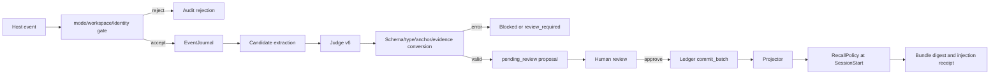

# Normal Workspace Guarded Rollout Design

**日期：** 2026-09-08
**状态：** 设计文档，未授权生产启用
**前置证据：** v6 Judge 基线、S3-3/S3-4 通过、S3-5/G6 隔离纵向 `103/103` 通过

## 1. 目标与边界

本设计定义 SagaContext 从隔离验收进入正常 workspace 灰度运行的方式。目标是让
真实 workspace 的事件能够进入受控候选、审核、写入、投影和 SessionStart 召回链路，
同时保留明确的关闭、审计和回滚路径。

本设计不授权立即启用。它不导入历史私人 transcript，不改变 Ledger 的唯一权威边界，
不允许模型输出绕过 proposal/review 直接写入，不把一次 G6 结果当作任意会话质量证明。
正常 workspace 的具体启用仍需要单独批准 workspace、事件类型、写入权限和召回/注入权限。

## 2. 运行模式

运行模式是显式配置，默认值为 `off`：

| 模式 | 事件采集 | Judge/候选 | 正式 Ledger 写入 | SessionStart 注入 |
|---|---|---|---|---|
| `off` | 关闭 | 关闭 | 关闭 | 关闭 |
| `shadow` | 允许 | 允许 | 关闭 | 关闭 |
| `guarded` | 允许 | 允许 | 仅 `pending_review` 后审核提交 | 仅审核通过的当前记忆 |
| `active` | 允许 | 允许 | 自动提交 | 自动注入 |

首次正常 workspace 灰度只允许 `guarded`。`active` 不是本设计的默认或自动后续状态。
切换模式必须写入配置变更 receipt，记录操作者、时间、workspace、旧值、新值和原因。

## 3. 启用范围

首轮灰度固定为：

- workspace：`/Users/lqy0584/Downloads/SagaContext`
- 数据：启用后的新事件；不扫描或导入历史私人 transcript
- 事件：`SessionStart`、`UserPromptSubmit`、`Stop`、`SessionEnd`
- Judge：冻结 `openai-judge-prompt-v6`、`delta-v3`、`delta-to-proposal-v2`
- 后端：已准入 OpenViking generation；Ledger 仍是正文和状态的唯一来源
- 宿主：已验证的 Codex event receipt；不扩大到未经 G3 验证的事件

事件处理前必须验证 workspace identity、owner、session identity、host version 和
generation。越界事件只产生安全拒绝审计，不进入候选或注入。

## 4. 事件与数据流



`UserPromptSubmit`、`Stop` 和 `SessionEnd` 负责事件记录、候选维护和对账触发，不直接
向宿主注入正文。只有 `SessionStart` 可以产生 context injection，而且每次都要重新
从 Ledger 和后端 hit 组装 bundle。

## 5. 候选、Judge 与写入

候选必须带有 session、workspace、owner、task（若有）、event IDs、memory type hint、
scope hint 和 topic key。候选选择只使用启用后的事件，候选来源和 input digest 写入 batch。

Judge 输出先经过以下不可绕过的检查：

1. Wire schema 和安全诊断检查。
2. `type == memory_type_hint`；relation 与 memory type 独立，`conflict` 不是 memory type。
3. anchor、revision、scope、candidate coverage 和 evidence IDs 属于冻结上下文。
4. refine 保留 anchor 的完整 body；固定命令、路径和枚举不接受解释性改写。
5. converter 失败为 non-retryable blocked，不转成 `no_change`。

合法 proposal 的默认状态是 `pending_review`。审核前不进入正式 memory，不进入可注入
bundle。审核批准调用现有 `BatchWorker -> Ledger.commit_batch -> Projector` 路径。
`supersede` 必须在同一事务内退役旧记忆并创建后继；任一操作失败都回滚。
`conflict` 进入人工处理，不自动替换当前记忆。

## 6. 召回与注入

SessionStart hook 只接受已批准 workspace 的事件，并重新读取 Ledger。后端结果仅提供
hit identity、revision、generation 和 locator；正文从 Ledger 当前 revision 读取。
RecallPolicy 按以下顺序拒绝候选：owner、generation、missing、inactive、revision、
conflict、scope、duplicate、budget。所有省略原因写入 bundle receipt。

注入 receipt 必须包含 bundle digest、ledger sequence、owner、generation、session digest、
item memory IDs/revisions、omissions 和 mode。宿主消费结果另行记录，不能用 hook 输出
证明任务实际使用了记忆。任何 bundle digest 不匹配都阻断注入并触发告警。

## 7. 灰度限制与退出条件

首轮 `guarded` 灰度限制：最多 10 个真实 session 或 24 小时，以先达到者为准；最多
20 条自动候选；Judge 每个 batch 最多 3 次尝试，单请求 timeout 300 秒；注入 bundle
沿用 2000 单位预算。只允许该 workspace 的新事件。

立即停用条件：

- 任意一次错误 owner/scope/revision/generation 的正文进入 bundle；
- 任意一次删除或取代后的旧 revision 被召回；
- Ledger 与 projection 不一致且无法在规定窗口内恢复；
- schema、conversion、认证错误未被阻断，或出现未授权 retry；
- 审计 receipt 缺失、bundle digest 不匹配或 cleanup 失败；
- hooks 越过 workspace 边界，或候选读取历史私人数据。

灰度结束需确认：所有 proposal、review、commit、projection、bundle 和 injection
receipt 可关联；没有越权或旧版本注入；pending 队列可解释；停止后下一会话不再产生
新注入；测试记忆和临时 projection 能按 receipt 清理。

## 8. Kill Switch 与回滚

保留两个独立关闭开关：

```text
SAGACONTEXT_MODE=off
<runtime-plan-directory>/STOP
```

检测到任一开关后，hook fail-closed：停止新候选、写入和注入；维护 worker 停止领取
新 batch。正在执行的宿主进程组按超时策略终止，随后进入清理。开关触发和终止原因写
入审计，不删除历史证据。

已提交记忆通过显式 `forget`、审核回退或受控 revision 回滚处理，不直接删除 SQLite
记录。回滚顺序为：停用 hooks、停止 worker、冻结新 projection、处理 pending/active
proposal、删除或回退 memory、清理 OpenViking projection、验证新会话 bundle 为空或只
含允许版本、最后检查 owner 和 namespace 清理。

## 9. 审计与隐私

审计最少包含：mode receipt、event receipt、candidate/batch digest、Judge status/error
class、proposal/review receipt、Ledger sequence/revision、projection receipt、RecallPolicy
bundle digest、injection receipt、task consumption result 和 rollback receipt。

artifact 不得包含 API key、Authorization header、明文 endpoint、完整 provider response、
私人 transcript 路径或未脱敏正文。需要诊断时只保留安全错误分类、位置、digest 和固定
摘要。生产日志与 artifact 分开控制保留期。

## 10. 实现拆分

1. `RuntimeMode`、workspace allowlist、配置变更 receipt 和 fail-closed 默认值。
2. Normal Host Adapter：复用已验证事件 receipt，拒绝未知 host/version/workspace。
3. Candidate Scheduler：事件到 candidate/batch 的边界、去重和数量限制。
4. Review Gate：默认 `pending_review`，禁止 guarded 模式绕过审核提交。
5. Injection Gate：SessionStart fresh recall、bundle digest、receipt 和消费结果分离。
6. Kill Switch：环境变量、STOP 文件、worker/host 进程终止与清理。
7. Audit/Report：按 session、candidate、proposal、revision、bundle 和 rollback 关联。
8. Gray Runner：10 session/24h/20 candidate 上限、停止条件和最终清理。

## 11. 验收矩阵

| 层级 | 必须证明 | 失败处理 |
|---|---|---|
| Hook | 四类事件、workspace/owner/session 校验、去重 | 拒绝并审计，不进候选 |
| Candidate | 新事件来源、scope、topic、digest 完整 | quarantine |
| Judge | v6 schema、type/relation、evidence、完整 body | blocked 或 retryable transport retry |
| Review | guarded 模式必须人工批准 | 保持 pending |
| Ledger | CAS、revision、原子 supersede、forget receipt | 回滚并停用 |
| Projection | generation、locator、删除和恢复 | 停用，执行清理 |
| Recall | 权限、scope、revision、budget、正文来源 | omission 或阻断注入 |
| Injection | fresh bundle、digest、实际消费分离 | 不注入并停用 |
| Rollback | STOP/off 生效，资源和状态可验证 | 保留 artifact，人工处理 |

## 12. 发布顺序

1. 只安装配置和 `off` 模式，运行静态检查与本地回归。
2. 在同一 workspace 开启 `shadow`，观察事件、候选和 bundle，不写入、不注入。
3. 复核审计和拒绝样本，确认没有历史私人数据进入。
4. 开启 `guarded`，允许 pending proposal 和人工批准写入；只给审核通过内容注入。
5. 完成 10 session/24h 灰度并运行回滚演练。
6. 依据灰度报告另行决定是否申请 `active`；本设计不自动进入 active。

## 13. 前置与后续

已完成的 v6 Judge、S3-3、S3-4 和 S3-5/G6 是进入本设计的前置证据，但不替代正常
workspace 的灰度结果。实现完成后应生成独立配置 receipt、灰度 artifact 和回滚 artifact，
并更新 `docs/probes/README.md`。在这些证据完成前，默认模式保持 `off`。
