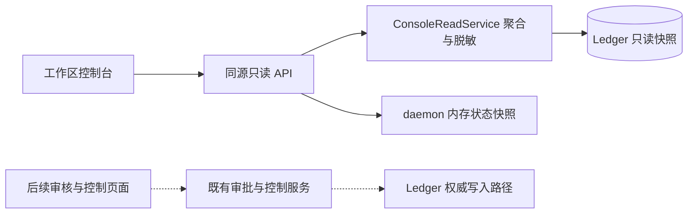

# SagaContext 工作区运行控制台：设计定稿

日期：2026-09-11。状态：用户已批准定稿（“可定稿”）。批准范围包括工作区网格首页、第一期只读功能、第二期审核操作的分期、技术路线与验收条件。源码核对基线：`13f0bc6`；定稿时另核对同日工作树中的真实 Scheduler 验收报告。

用户已选择：运行控制台 → 工作区优先 → 项目总览网格。本文将三个选择合成一套设计；交互线框使用虚构示例数据，不代表本机运行状态或已实现的前端。

## 1. 目标与选择

打开一个项目后，用户应能回答：当前工作区发生了什么、哪些记忆发生了变化、运行是否被阻断、待审核内容从哪里来。点击摘要后，应能沿稳定 ID 追溯到原始回执与允许查看的证据。

已比较的方向：

| 方向 | 优势 | 取舍 | 本方案中的位置 |
|---|---|---|---|
| 工作区运行控制台 | 日常状态、任务与记忆变化集中呈现 | 需要聚合查询和准确归属 | 主入口，用户已选 |
| 记忆探索器 | 适合解释版本、作用域与来源 | 难以第一眼判断运行是否异常 | 二级「记忆与证据」 |
| 证据与验收工作台 | 便于比较固定实验和准入结果 | 历史实验不能代表实时状态 | 后续独立视图 |

项目首页采用四卡网格；时间线放在卡片下方；详情页继承当前 project/workspace 上下文。关系图只用于单条记忆的版本与证据关系，不建设全局力导向知识图谱。

## 2. 已核实的实现与约束

| 事实 | 源码或记录 | 对可视化的影响 |
|---|---|---|
| Python + FastAPI daemon，已有 CLI，无独立前端工程 | `pyproject.toml`、`src/sagacontext/daemon.py` | 建议复用 daemon 提供同源静态资源与读取 API |
| Ledger schema v5 存储 project、location、workspace、task、session、revision 和 evidence | `src/sagacontext/ledger/schema.py` | 以 Ledger 身份与归属建模，不能依靠目录名关联 |
| 一个 owner 最多一个处于 running/draining/stopping/cleanup_required 的 rollout | `one_live_rollout_per_owner` 索引 | 多工作区浏览不意味着多工作区可并行启动 |
| 运行模式只开放 off/shadow/guarded；activate 拒绝 active | `src/sagacontext/rollout.py` | 不显示可选的 active 模式 |
| daily_report 已有队列、配额、批次、提案、延迟、观察样本和清理统计 | `src/sagacontext/daily_report.py` | 可复用统计语义，但需要按工作区组织并提供浏览器接口 |
| daemon 已有 current/history、outbox、audit 等接口，缺少工作区首页聚合和分页列表 | `src/sagacontext/daemon.py` | 不能把现有接口列表直接视为前端已具备完整数据支持 |
| RecallPolicy 校验 owner、scope、revision、generation、inactive、conflict 和 budget | `src/sagacontext/recall_policy.py` | 可显示回执里的省略原因；实际正文仍来自 Ledger |
| InjectionReceipt 保存 ID/版本、omissions、快照序列等，未保存完整 budget/used/accounting | `src/sagacontext/rollout.py` | 第一期不展示历史 token 开销/节省图；不重跑召回来补造历史 |
| rollout.mode 经 _run() 可能因 STOP/deadline 更新状态；/health 使用此属性 | `src/sagacontext/rollout.py`、`daemon.py` | 首页读取不能照搬该路径，必须提供无写入副作用的快照读取 |
| 质量值只针对被标注对象，unknown 不进入 yes+no 分母 | `observation_metrics()` | 零有效样本显示空值，不显示 0% 或 100% |
| 09-11 离线验收不包含真实宿主消费；同日真实报告记录单次 scheduler 闭环通过，长期稳定性仍需观察 | `docs/probes/2026-09-11-offline-scheduler-acceptance.md`、`docs/probes/2026-09-11-scheduler-real-acceptance.md` | 区分离线验证、单次真实闭环和日常观察，不把报告快照当当前健康状态 |

本轮核对范围为源码和报告，没有检查真实服务、凭据或本机记忆正文。上述最后一行引用同日报告，本轮没有独立重跑，也不据此推断当前开关状态。

## 3. 首页结构

桌面端使用左侧项目导航 + 右侧二列卡片，窗口变窄后转为单列。

```text
项目 / 工作区导航        当前项目 / 当前工作区            快照时间
                       服务连接 · 调度器 · 有效模式 · 停止原因
                       ┌──────────────────┬──────────────────┐
                       │ 当前任务         │ 运行与待审核      │
                       │ 目标、状态、绑定 │ 模式、截止、配额   │
                       │ 检查点来源       │ 阻断原因、待审批次 │
                       ├──────────────────┼──────────────────┤
                       │ 最近会话         │ 记忆变化          │
                       │ 宿主、起止、任务 │ 新增、补全、取代   │
                       │ 最近事件         │ 投影状态、来源     │
                       └──────────────────┴──────────────────┘
                       最近活动 → 可点击的对象与证据入口
```

**当前任务**：任务以项目为归属，以 task_bindings 与当前工作区的 session 关联。在卡片显示最近有关联的 active 任务，可进入项目全部任务。没有绑定时显示「暂无关联任务」。检查点先展示真实 checkpoint_requested 事件及时间；没有已持久化摘要时不生成进度百分比或下一步。

**运行与待审核**：显示当前工作区运行及最近结束的运行；分别展示 mode 与 lifecycle status、截止时间、已占配额、待审 batch 数和最近明确失败原因。另一个工作区正在运行时，在全局状态区提示其归属；不能将它的配额和告警算入当前工作区。

**最近会话**：按当前 workspace 筛选，显示 host、opened_at、closed_at、关联任务和最近事件。closed_at 缺失显示「尚无结束事件」，不能推断宿主在线。

**记忆变化**：默认「今日、本工作区 rollout 产生的已提交变更」，从 rollout_commits 归因。按明确操作统计；待审核 proposal 不计入新增。点入记忆页后再切换「项目适用记忆」和「全局记忆」。索引投影成功与记忆已提交分别呈现。

**最近活动**：首页展示最近 20 条关联活动，列表页每页 50 条。事件使用 received_at，其他对象使用 created_at，以「记录时间 + 对象类型 + 稳定 ID」降序排列；事件详情另列 occurred_at。默认今日按浏览器时区计算日界并转换为 UTC 查询，页面显示时区。checkpoint、proposal、commit、projection、injection、consumption 不是严格一一对应的线性漏斗，不在首页用计数箭头暗示转化率。

卡片的状态与配额为当前快照；「今日」只修饰记忆变更与活动窗口。所有页面显示时间范围，避免把累计配额占用误看为今日增量。

## 4. 下钻与交互

1. 首页「待审核」→ 当前工作区批次列表 → 提案新旧内容、expected_revision、作用域、脱敏理由与 evidence → 来源会话或受控证据页。
2. 首页「记忆变化」→ memory_id + revision → 版本历史与取代关系 → revision_evidence → 允许查看的来源。无可验证来源关联时显示「来源不可定位」，不拼接虚假的链接。
3. 首页「最近会话」→ 事件与关联批次 → 注入回执 → memory_ids/revisions 和 omissions。区分已输出、存在消费记录、操作者观察标签；不把三者合并成一个「成功」状态。
4. 首页「运行状态」→ rollout 明细 → 批次、projection operation、rollback 状态。停止接收与清理完成是独立状态；cleanup_required 始终保留可见提示。

全局选择固定 project_id/workspace_id；URL 保存对象 ID 和列表筛选，使浏览器前进/后退能恢复上下文。记忆详情同时显示自身 scope，不能用页面 workspace 偷换记忆作用域。

桌面列表详情可用侧栏快速浏览，并提供独立详情 URL；小窗口转为整页。线框的弹窗仅用于说明将来的下钻内容，不代表正式页面已实现。

## 5. 技术建议

建议采用 React + TypeScript + Vite，构建产物由现有 FastAPI 同源提供。第一期以路由、表格、卡片、详情和状态栏为主，查询缓存采用 TanStack Query；没有实际图表需求前不引入图谱库或大屏图表体系。生产启动不要求单独运行 Node 服务。

备选方案是 FastAPI 模板 + HTMX，部署轻，但后续对象详情、跨页筛选和审批交互会增加模板状态管理成本。纯静态报告适合留档，无法满足工作区日常下钻；因此仅作为快照导出形式保留。



四个边界：

- 页面组件只接收展示 DTO，不读取 SQLite，也不访问 OpenViking 或本机配置。
- 读取服务用专门 SQLite 只读连接与短事务，封装 owner/workspace 校验、分页、聚合、正文权限与脱敏；不在读取请求中新建 Application、运行迁移或调用会更新状态的 rollout.mode/_run()。
- 状态 DTO 分别给出 persisted_status、configured_mode、effective_mode、block_reason、observed_at。effective_mode 可从配置、STOP 和截止时间纯计算，状态推进仍由原控制/调度路径完成。无法观测的项返回 unknown。
- 后续写入全部调用既有领域服务，保持回执、摘要、版本校验与幂等约束，不新增直写记忆接口。

第一期的入口是已经运行的 daemon 上的 console 页面。页面打开、轮询、导航不会启动 scheduler、触发 Judge 或注册 rollout。页面已经载入后服务断连，由页面显示过期快照；首次打开时 daemon 不可达则是浏览器连接错误，需要先启动服务。开发用 fixture 模式与真实 API 模式明确分开。

### 建议新增的读取接口（均未实现）

统一前缀 `/console/v1`。项目和工作区由 Ledger 注册关系验证，owner 来自服务端身份。

| 路径 | 返回内容 |
|---|---|
| `GET /projects` | 当前 owner 的项目与工作区目录 |
| `GET /workspaces/{workspace_id}/overview` | 四卡摘要、当前运行、关联活动、快照元数据 |
| `GET /workspaces/{workspace_id}/sessions` | 分页会话与任务绑定摘要 |
| `GET /projects/{project_id}/tasks` | 项目任务，附当前工作区关联信息 |
| `GET /workspaces/{workspace_id}/activity` | 按类型、时间筛选的分页活动 |
| `GET /workspaces/{workspace_id}/batches` | 当前/历史 batch 状态与待审标记 |
| `GET /workspaces/{workspace_id}/rollouts/{rollout_id}` | 运行、配额、质量样本与清理摘要 |
| `GET /workspaces/{workspace_id}/batches/{batch_id}` | proposal、目标版本、证据与回执 |
| `GET /projects/{project_id}/memories` | 作用域明确的分页记忆目录，可用 workspace 过滤变更来源 |
| `GET /workspaces/{workspace_id}/memories/{memory_id}` | 使用验证后的 TaskContext 返回当前版本与历史、证据 |
| `GET /workspaces/{workspace_id}/sessions/{session_id}` | 事件元数据、任务绑定、关联批次与注入回执 |

项目级记忆、路径级和任务级记忆按现有 Scope/TaskContext 规则校验；路径级记忆需要有效 touched_paths，任务级需要已验证任务，不从 ID 猜测授权。跨 owner、无关联 workspace 或不允许查看的正文统一返回不可访问，不返回其他作用域的摘要。

每次 overview 用一个读取事务返回一致的 Ledger 数据，元数据包含 observed_at、schema_version、ledger_sequence、request_id、各模块 availability。进程健康是同次读取的独立观察，不声称与数据库更新原子一致。

不能只用 ledger_sequence 做缓存版本：审计、审批和运行状态变化未必递增记忆序列。第一期固定可见页每 5 秒刷新，后台页暂停；报错按 5/10/20/30 秒上限退避。工作区切换取消旧请求，缓存键带 project/workspace/filter，旧响应不能覆盖新页面。首期不引入 WebSocket；有实际需求后再设计 SSE。

接口设置分页上限 100，默认 50。列表 DTO 仅提供必要字段和脱敏摘录，原始 event payload、凭据、基础设施地址、完整 transcript 不序列化到浏览器。新增读取路由按本地同源访问设计，校验 Host/Origin，不开放任意跨域；不将 operator token 下发给前端。

## 6. 状态、质量口径与失败处理

| 情形 | 呈现 |
|---|---|
| 无项目/工作区或无会话 | 清晰空态，接入条件说明；不自动创建或启用 |
| 无获准运行 / off | 中性「未启用」；已有记忆和历史仍可浏览 |
| shadow / guarded | 分别解释为观察与受控运行，状态与模式各自显示 |
| blocked / retry / awaiting_review | 显示原因、下次重试时间或待审对象；不统一用红色失败 |
| 停止但未清理 | 明确「已停止，仍有清理任务」 |
| 后端缺失/超时 | 显示投影或后端状态不可用，Ledger 可读数据继续显示 |
| 数据库忙/读取超时 | 返回可重试错误，保留上次快照和其时间；当前状态标为未知 |
| 单模块失败 | 该卡片显示不可用；缺失不能转换成 0；正常模块继续显示 |
| 无质量标注 | `— 待采样`，有效样本为 0 |
| 有标注 | 显示 yes、no、unknown、有效分母和采样范围；比例仅为已标注子集 |
| 无延迟样本 | P50/P95 为空，并显示 samples=0 |
| 注入为空/已输出但无消费证据 | 单独标记；不得声称 Agent 已使用或遵守 |
| 异常请求对象不存在/不归属 | 不暴露对象信息，返回不可访问 |

颜色和文字共同表达状态：绿色用于有证据的完成/可达；琥珀表示等待或受限；红色用于明确失败/清理异常；灰色表示关闭/未知。模式不是健康程度，GUARDED 本身不能作为绿色「一切正常」的证明。

## 7. 交付顺序

**第一期：工作区可观测性。** 只读聚合、工作区导航、四卡首页、分页会话/任务/批次、提案和记忆证据下钻、运行/投影/回滚摘要、零样本与失败状态。首期完成后，用户能在页面中定位一个待审批次及其来源，并解释一条已提交记忆与索引投影的不同状态。

**第二期：日常审核与观察。** 在第一期对象链路上接入已有 approve/reject、枚举质量标签、STOP 和回滚入口。审批按 batch 执行，展示完整改动与关联证据；不提供当前没有实现的正文编辑。写入需要单独设计浏览器会话授权、CSRF、服务端持有凭据、固定 action/target/digest/receipt，以及超时后先查原回执的交互；通过该设计验收后才开放按钮。停止与回滚分别说明实际影响，不做每次浏览的多余确认。

**第三期：解释与实验分析。** 如需预算可视化，先补充实际注入时的 trace 持久化契约，并对旧记录明确显示明细缺失；实验页按固定 run/dataset/model/policy 展示 artifact，不把合成测试通过数混入日常消费率。

本次定稿交付第一期设计与线框；第二/三期是独立后续范围，不承诺在第一期实现，也不以第一期上线为由扩大现有宿主准入、工作区或配额。

## 8. 实施时验收条件

1. 选择两个注册工作区分别浏览，任务归属、session、rollout、变更来源与证据权限正确；项目共享/全局记忆不被重复计为工作区新增。
2. fixture 的四卡汇总与 Ledger 行/回执可对账；待审 proposal 不计作已提交，投影 pending 不显示为检索可用。
3. 候选 → batch → proposal → commit → evidence 与会话/注入关联可点击验证；缺失关联明确提示。
4. 在独立测试库中冻结调度器，执行所有读取/刷新后，数据内容、control epoch、审计记录、配置与 STOP 状态不变；Judge/后端网络调用次数为零。
5. 断连、SQLite busy、无样本、部分卡片失败、清理进行中或 cleanup_required、跨作用域访问均有正确可辨识状态；未知不转成成功或 0%。
6. 已标注比例严格使用 yes+no；unknown 单列；确认消费记录与人工观察标签分开展示。
7. 仅审批/审计变化且 ledger_sequence 不变时，轮询仍能发现新状态；快速切换工作区不会显示前一工作区的迟到响应。
8. 1440、1024、390 CSS 像素下分别验证网格、窄窗口与单列布局；键盘可到达导航和详情并关闭弹层，无横向内容截断。
9. 检查 API 响应与前端 bundle，不含密钥、配置、基础设施地址或原始 transcript；页面无对外 CDN 依赖。
10. 实施完成后运行相关读取服务/API/交互测试及仓库回归；本轮文档和线框检查不替代这些功能验收。

## 9. 本轮审阅材料

- 已归档的交互线框：[工作区总览 v1](assets/2026-09-11-workspace-overview-v1.html)，静态 HTML 可独立打开并随定稿提交。
- companion 页面：`http://localhost:51171/`；服务会因空闲自动退出，HTML 文件保留。
- 预览支持卡片下钻说明，以及「有活动」「尚无数据」「连接中断」三种状态；全部为虚构示例。
- `.superpowers/` 为本地设计预览目录，不纳入正式产品构建；实施时将正式前端放入独立 `web/`，不使用 companion 服务承载产品。

2026-09-11，用户确认“可定稿”。上述首页与分期已获批准，不再重复请求设计确认。第一期实施拆分见[实施计划](../plans/2026-09-11-workspace-console.md)；计划中的验证为待执行事项，不能视为功能已经交付。
